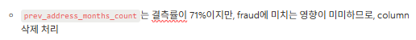
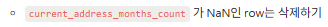
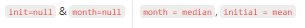
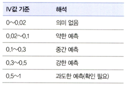
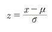
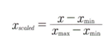
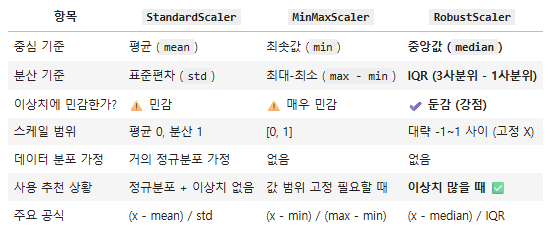
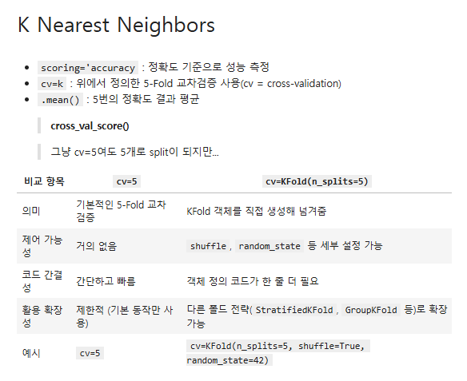
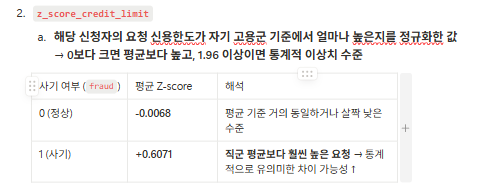

# 통계학 5주차 정규과제

📌통계학 정규과제는 매주 정해진 분량의 『*데이터 분석가가 반드시 알아야 할 모든 것*』 을 읽고 학습하는 것입니다. 이번 주는 아래의 **Statistics_5th_TIL**에 나열된 분량을 읽고 `학습 목표`에 맞게 공부하시면 됩니다.

아래의 문제를 풀어보며 학습 내용을 점검하세요. 문제를 해결하는 과정에서 개념을 스스로 정리하고, 필요한 경우 추가자료와 교재를 다시 참고하여 보완하는 것이 좋습니다.

5주차는 `2부. 데이터 분석 준비하기`를 읽고 새롭게 배운 내용을 정리해주시면 됩니다.


## Statistics_5th_TIL

### 2부. 데이터 분석 준비하기
### 11.데이터 전처리와 파생변수 생성


## Study Schedule

|주차 | 공부 범위     | 완료 여부 |
|----|----------------|----------|
|1주차| 1부 p.2~56     | ✅      |
|2주차| 1부 p.57~79    | ✅      | 
|3주차| 2부 p.82~120   | ✅      | 
|4주차| 2부 p.121~202  | ✅      | 
|5주차| 2부 p.203~254  | ✅      | 
|6주차| 3부 p.300~356  | 🍽️      | 
|7주차| 3부 p.357~615  | 🍽️      | 

<!-- 여기까진 그대로 둬 주세요-->

# 11.데이터 전처리와 파생변수 생성

```
✅ 학습 목표 :
* 결측값과 이상치를 식별하고 적절한 방법으로 처리할 수 있다.
* 데이터 변환과 가공 기법을 학습하고 활용할 수 있다.
* 모델 성능 향상을 위한 파생 변수를 생성하고 활용할 수 있다.
```


## 11.1. 결측값 처리

### 결측치의 종류
✔️ 분류 : 결측치가 **발생하는 특성**에 따라
>(1) 완전 무작위 결측 : 결측값이 **무작위로 발생**하는 경우
>
>(2) 무작위 결측 : **다른 변수의 특성에 의해** 체계적으로 발생
>
>(3) 비무작위 결측 : 결측값들이 **해당 변수 자체의 특성**을 지님

✔️ 처리방법
(1) 표본 제거 방법 : 결측값이 심하게 많은 변수 제거 or 포함된 행 제거


결측값이 전체 데이터의 75% 이상 -> 타겟변수와의 상관관계를 고려 후 제거 판단



결측값이 전체 데이터의 1% 미만 -> 결측값이 존재하는 행만 제거

(2) 통계치 대치(평균, 중앙값, 최빈값, 최대•최소값)


단점 : 통계량의 표준오차가 왜곡되어 축소되어 나타나고 p-value가 부정확하게 됨

(3) 회귀 대치법(회귀식을 이용하여 결측값 추정)
장점 : 해당 변수와 다른 변수 사이의 **관계성**을 고려하여 결측값 계산 -> 합리적 
- ex. 확률적 회귀대치법 : 인위적으로 회귀식에 확률 오차항 추가

(4) 다중 대치법(단순대치를 여러 번 수행 후 그 평균으로 결측값 대치)
- 대치 단계 : 가능한 대치 값의 분포에서 추출된 서로 다른 값으로 결측치를 처리한 n개의 데이터셋 생성
- 분석 단계 : 생성된 각각의 데이터셋을 분석하여 모수의 추정치와 표준오차 계산 
- 결합 단계 : 계산된 각 데이터셋의 추정치와 표준오차를 결합하여 최종 결측 대치값 산출 

```
회귀대치법을 한 번도 해보지 않았으니 다음에는 염두에 두어야겠다..!
```

## 11.2. 이상치 처리
(1) 이상치
- 정의 : 일부 관측치의 값이 전체 데이터의 범위에서 크게 벗어난 아주 작거나 큰 **극단적인 값**
- 전체 데이터의 양이 많을수록 제거 필요성이 낮아짐 

(2) 처리 방식
- 결측값으로 대체하여 처리하거나 해당 이상치를 제거 
  - 단점 : 실제값을 과장하여 편향 발생
```
평소에는 boxplot, boxenplot을 본 후 이상치 제거 판단을 한 듯
```
- **관측값 변경** : 하한값, 상한값 결정 후 이상치를 해당 값으로 대체 
- **가중치 조정** : 이상치의 영향을 감소시키는 가중치를 부여

## 11.3. 변수 구간화
❓ 이산형 변수를 범주형 변수로 비즈니스적 상황에 맞도록 변환 -> 데이터의 해석이나 예측, 분류 모델을 의도에 맞도록 유도

- 이산값 평활화하여 단순하 이산 값으로 변환, 변수의 값을 일정한 폭, 빈도로 나눈 후 구간 안에 속한 데이터 값을 통계치 등으로 변환 
- 클러스터링으로 구간화할 변수 유사 변수끼리 묶어줌
- 의사결정나무 -> 타깃변수 설정해 구간화할 변수의 값을 타깃 변수 예측에 가장 적합한 구간으로 분류 

✔️구간화 검증
**WOE, IV** 등 사용


## 11.4. 데이터 표준화와 정규화 스케일링
🔍표준화와 정규화
- 표준화 : 각 관측치의 값이 전체 평균을 기준으로 어느 정도 떨어져 있는지 나타낼 때 사용
  - 
- 정규화 : 데이터의 범위를 0부터 1까지 변환하여 데이터의 분포를 조정
  - 

✔️표준화, 정규화 보완
(1) 스케일링 기법


(2) KNN

```
캐글 스터디 때 배운거!
```

## 11.5. 모델 성능 향상을 위한 파생 변수 생성
- 파생변수 : 원래 있던 변수들을 조합하거나 함수를 적용하여 새로 만들어낸 변수



```
이번에는 통계치로만 파생변수 설정을 하였는데 다음 기회에는 가설을 세워서 검증을 해보며 파생변수를 세우면 좋을 듯함
```


<br>
<br>

# 확인 문제

## 문제 1. 데이터 전처리

> **🧚 한 금융회사의 대출 데이터에서 `소득` 변수에 결측치가 포함되어 있다. 다음 중 가장 적절한 결측치 처리 방법은 무엇인가?**

> **[보기]   
1️⃣ 결측값이 포함된 행을 모두 제거한다.  
2️⃣ 결측값을 `소득` 변수의 평균값으로 대체한다.  
3️⃣ `연령`과 `직업군`을 독립변수로 사용하여 회귀 모델을 만들어 `소득` 값을 예측한다.  
4️⃣ 결측값을 보간법을 이용해 채운다.**

> **[데이터 특징]**     
    - `소득` 변수는 연속형 변수이다.  
    - 소득과 `연령`, `직업군` 간에 강한 상관관계가 있다.  
    - 데이터셋에서 `소득` 변수의 결측 비율은 15%이다.

```
3️⃣ `연령`과 `직업군`을 독립변수로 사용하여 회귀 모델을 만들어 `소득` 값을 예측한다.  
```

## 문제 2. 데이터 스케일링

> **🧚 머신러닝 모델을 학습하는 과정에서, `연봉(단위: 원)`과 `근속연수(단위: 년)`를 동시에 독립변수로 사용해야 합니다. 연봉과 근속연수를 같은 스케일로 맞추기 위해 어떤 스케일링 기법을 적용하는 것이 더 적절한가요?**

<!--표준화와 정규화의 차이점에 대해 고민해보세요.-->

```
실제 연봉 데이터는 이상치가 존재할 가능성이 높으므로 RobustScaler
(단, 정규분포에 가까울 경우 StandardScaler)
```

### 🎉 수고하셨습니다.